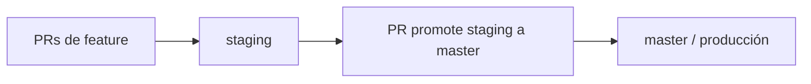

# Despliegue: `staging` → `master` (promoción a producción)

Guía operativa para agrupar varios PRs de feature en **staging**, probarlos juntos y promover **una sola vez** a producción (`master`). Así cada merge de feature no dispara un deploy de prod en Vercel + Render.

La rama por defecto del repo **sigue siendo `master`** (producción). No se hace force-push a `master`.

## Ramas

| Rama | Rol | Qué dispara un push / merge |
| --- | --- | --- |
| `master` | Producción | **Vercel Production** + **Render** API de prod (`special-funicular-3q60` o el servicio actual). |
| `staging` | Integración / lote | **Vercel Preview** (no prod). API de staging **opcional** (ver [modelos de staging](#modelos-de-staging-api)). |

Comprobado en GitHub: la rama `staging` existe y apunta al mismo commit que `master`. Si en el futuro desaparece, créala desde el tip de `master` **sin** force-push (ver [Si falta la rama staging](#si-falta-la-rama-staging)).



---

## Flujo diario

1. Abre el PR de feature con **base `staging`**, no `master`.
   GitHub usará `master` por defecto (es la default branch). Cambia el selector **base** a `staging` antes de crear el PR.
2. Revisa y fusiona el feature en `staging`.
3. Ese merge **no** despliega producción:
   - Frontend: Preview en Vercel (URL de preview del branch `staging` o del PR).
   - Backend: nada en el servicio de prod; API de staging solo si existe el servicio clonado.
4. Cuando el lote esté listo (varios features en `staging`, smoke OK): abre **un** PR de promoción **`staging` → `master`**.
5. Revisa ese PR una vez, fusiónalo → **un solo** deploy de producción (Vercel prod + Render prod).

Hábito: features van a `staging`; `master` solo recibe el PR de promote (o un hotfix, ver más abajo).

---

## Checklist de promote (`staging` → `master`)

Antes de fusionar el PR de promoción:

- [ ] **Smoke en la URL de staging** (Preview de Vercel del branch `staging`): login, listado de vehículos, un flujo de tiempos, dashboard. Si hay API de staging, úsala; si no, recuerda que el preview habla con la API de prod (modelo barato).
- [ ] **Migraciones / SQL**: si el lote incluye scripts en `backend/scripts/`, ejecútalos en Supabase **antes** (o en el orden que indique el PR) para que prod no arranque contra un esquema viejo.
- [ ] **Variables de entorno**: ¿hace falta alguna nueva en Vercel (frontend) o Render (API)? Añádela en **prod** (y en el servicio de staging si existe) **antes** del merge. No copies secretos a este doc ni a PRs públicos.
- [ ] **CORS / URL del frontend**: si el preview o un dominio nuevo debe llamar a la API, confirma que el origen está permitido en el backend (lista `allowedOrigins` / `FRONTEND_URL`). El Preview de Vercel genera hosts `*.vercel.app` distintos del dominio canónico `slotdatabase.es`.
- [ ] **Cron / jobs**: el Cron de Render del digest semanal apunta a la API de **prod**. No lo cambies al promover salvo que el lote toque esa ruta.
- [ ] Abre o actualiza el PR **`staging` → `master`**, revisa el diff agregado del lote, merge.
- [ ] Tras el merge: comprueba el deploy de Vercel Production y el de Render (`special-funicular-3q60`). Smoke rápido en `https://slotdatabase.es`.

---

## Configuración de plataformas

Solo checklists de clics. No cambiar auto-deploy de prod por API desde este flujo.

### Vercel (frontend)

Objetivo: **Production Branch = `master`**. Pushes a `staging` = Preview, no Production.

1. [Vercel Dashboard](https://vercel.com) → proyecto del frontend (monorepo, **Root Directory** = `frontend`; detalle en el [readme](../readme.md#deploy-en-vercel)).
2. **Settings → Environments** (o **Settings → Git**):
   - **Production Branch** = `master`.
   - `staging` **no** debe estar marcado como Production. Debe generar **Preview**.
3. **Settings → Git**: el repo está conectado; Ignored Build Step vacío salvo que sepas por qué lo usas.
4. Comprueba: un push a `staging` aparece en **Deployments** como **Preview**; un merge a `master` como **Production**.

Variables típicas de prod (nombres, no valores): `REACT_APP_API_URL`, `REACT_APP_SITE_URL`, opcionalmente `SITEMAP_BACKEND_URL`, `NODE_OPTIONS`. En Preview, `REACT_APP_API_URL` suele seguir apuntando a la API de prod en el modelo barato.

### Render (backend / API)

Servicio de producción: **`special-funicular-3q60`** (host `special-funicular-3q60.onrender.com`, o el web service que esté sirviendo la API actual).

1. [Render Dashboard](https://dashboard.render.com) → Web Service de prod.
2. **Settings → Build & Deploy**:
   - **Branch** = `master`.
   - **Auto-Deploy** = **Yes** (on).
3. Confirma que **no** hace auto-deploy desde `staging` (si el branch del servicio es `master`, un push a `staging` no toca prod).

#### API de staging (opcional)

Ver [modelos de staging](#modelos-de-staging-api). Si clonas el servicio:

1. En el servicio de prod: menú **… → Clone service** (o **New → Web Service** apuntando al mismo repo).
2. **Branch** = `staging`, **Auto-Deploy** = Yes.
3. Nombre distinto (p. ej. `special-funicular-staging`). **No** reutilices el mismo servicio de prod.
4. Copia las env vars necesarias (a mano o con “copy from”). Base de datos: o la misma Supabase (cuidado con datos reales) o un proyecto/schema de staging.
5. En Vercel Preview de `staging`, apunta `REACT_APP_API_URL` a esa API si usas el modelo completo.

### GitHub

1. **Settings → General → Default branch**: dejar **`master`**. Es la rama de producción. No la cambies a `staging`.
2. GitHub usa esa default branch como **base de PRs**. No hay un ajuste separado “default PR base = staging” sin mover la default branch. Por eso:
   - al crear un PR de feature, cambia **base** de `master` a **`staging`**;
   - o recuerda el selector cada vez (y en la descripción del PR de feature).
3. El PR de promote es el único que debe ir con **base `master`** y **compare `staging`**.

---

## Modelos de staging (API)

### A — Barato: Preview de Vercel + API de prod

- Merge a `staging` → Preview del frontend.
- El Preview llama a la API de **producción** (`special-funicular-3q60`).
- **Pros**: cero coste extra de Render; suficiente para UI, copy, layout.
- **Contras**: el Preview no aísla backend; migraciones o cambios de API pueden romper prod o no probarse; CORS puede bloquear orígenes `*.vercel.app` si no están permitidos.

Úsalo como default mientras no haya servicio clonado.

### B — Completo: Preview de Vercel + API de staging

- Segundo Web Service en Render con branch `staging`.
- El Preview de `staging` usa `REACT_APP_API_URL` de esa API.
- **Pros**: se prueban API + frontend juntos; migraciones y env nuevas se validan fuera de prod.
- **Contras**: otro servicio (plan, disco, cold start); hay que mantener env vars y, si aplica, una base no-prod.

Cuando exista el servicio B, el smoke del checklist de promote debe hacerse contra ese par (preview + API staging), no contra prod.

---

## PRs abiertos y transición

Tras el cutover (esta doc + rama `staging` en uso):

1. **Retarget** de PRs de feature en vuelo: en GitHub, **Edit** el PR → **base** = `staging` (si apuntaban a `master`).
2. PRs nuevos: base `staging` desde el primer momento.
3. No mezcles un lote a medias: si un PR ya se fusionó a `master` durante la transición, no lo re-merges a `staging` a ciegas; rebase `staging` desde `master` si hace falta para alinear.

En el momento de escribir esta guía, `staging` y `master` coincidían; no había PRs abiertos que retargetear. Si aparecen, la lista está en [Pull requests](https://github.com/adrianox92/special-funicular/pulls).

### Hotfixes

Siguen permitidos: PR de la rama de arreglo **→ `master`**.

- Úsalo solo si producción está rota o el arreglo no puede esperar al siguiente lote (seguridad, pago, datos, caída).
- Ese merge **salta el batch**: dispara prod al momento (Vercel + Render).
- Después, **trae el hotfix a `staging`** (merge `master` → `staging` o cherry-pick) para que el próximo promote no lo pise ni genere un conflicto raro.

No uses hotfix para features normales.

---

## Si falta la rama `staging`

No hagas force-push a `master`. En local, desde una copia actualizada:

```bash
git fetch origin
git checkout master
git pull origin master
git checkout -b staging
git push -u origin staging
```

Si `staging` existe pero se ha quedado atrás de `master` (p. ej. tras hotfixes), intégrala con un PR `master` → `staging` o un merge fast-forward. Evita reescribir `master`.

---

## Relacionado

- Config de build del frontend en Vercel: [readme.md — Deploy en Vercel](../readme.md#deploy-en-vercel)
- Cron semanal (Render, API de prod): [readme.md — Informe semanal](../readme.md#informe-semanal-render-cron)
